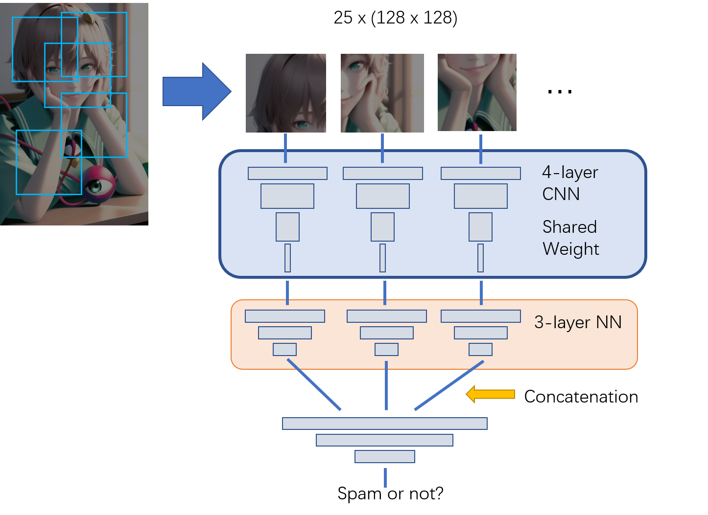
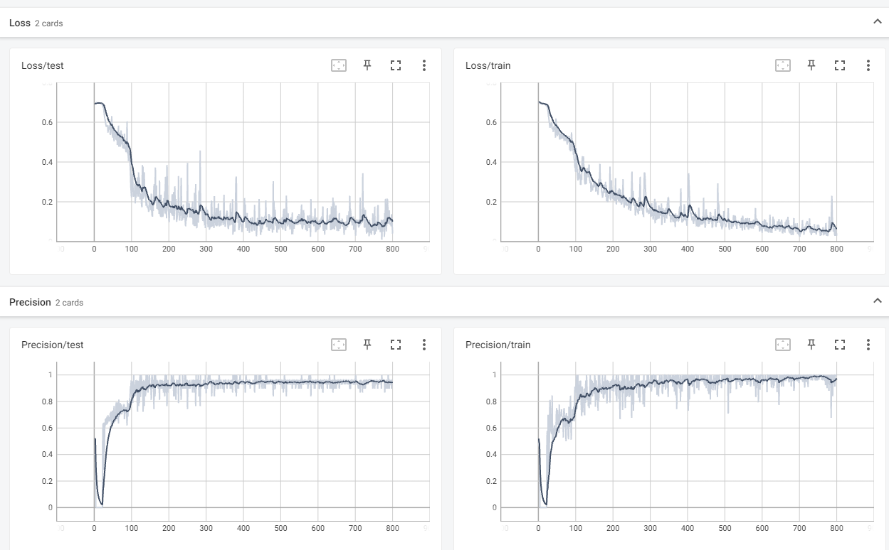

# Spam-Image-Detection

## Model

Chatting images are in various sizes. In early solutions, the images were reshaped to a fixed size, from which the network learned a lot from a unique grid-like pattern (and its reshaped pattern) in those spam images.

In the latest solution, 25 random sub-images are sampled from the raw image. They go through the same CNN and 25 neural networks. The output of 25 networks are concatenated to one network and return the final output.

## Dataset

My dataset contains 133 non-spam images and 122 spam images (will have more, while numbers won't be actively updated). Non-spam images in my dataset are from real chats. I focused on false positives reported from previous models as well as random images in my group chats.

## Motivation

Thanks to the crazy and disgusting spam images in public chat rooms that I help maintaining, I have to develop this CNN model to train models for our automatic administrative robots.

## Training

PyTorch and tensorboard are required. If no GPU is available, modify `device = 'cuda'` to `device = 'cpu'`. Spam images are supposed to be in `data/positive` while non-spams are in `data/negative`. 

Once training begins, run `tensorboard --logdir=./runs` to see real time loss and precision.

Batch size (and learning rate) in my code are tested to be runnable on NVIDIA MX450 with 2GB dedicated memory.

Before deploying, train on the whole dataset and switch `test_while_train` to `False`.

## Performance

- Precision (true positives out of all positives) on testing set: 95%

